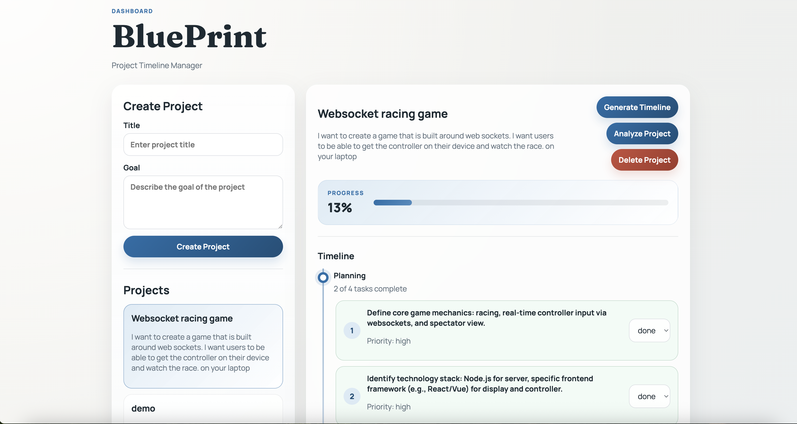
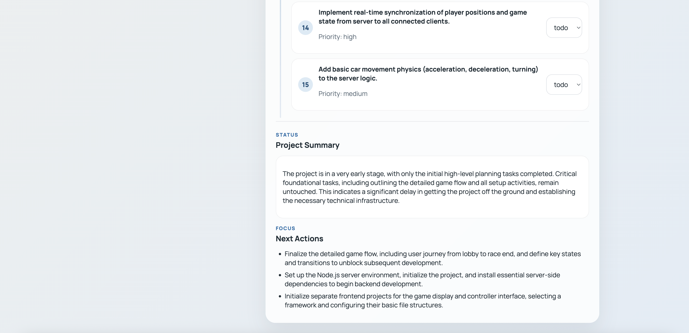
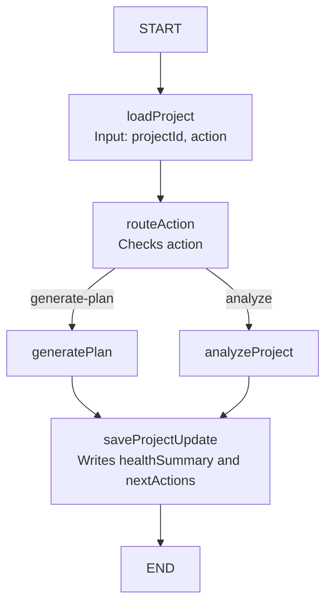

# AI Project Timeline Manager

## Description

AI Project Timeline Manager is a full-stack app that helps users turn a high-level goal into a structured project timeline. It uses AI to generate tasks and analyze project progress.

---

## Resource

### Project

The app uses one main resource: `Project`.

**Attributes:**

- title (String)
- goal (String)
- tasks (Array)
- healthSummary (String)
- nextActions (Array of Strings)
- createdAt (Date)
- updatedAt (Date)

**Task (embedded in Project):**

- phase (String)
- order (Number)
- title (String)
- status ("todo" | "done")
- priority ("low" | "medium" | "high")

---

## What it looks like

<p align="center">
  
</p>

<p align="center">
  
</p>
## REST API

- POST `/api/projects`
- Creates a new project

- GET `/api/projects`
- Returns all projects

- PATCH `/api/projects/:id`
- Updates project fields or tasks

- DELETE `/api/projects/:id`
- Deletes a project

- POST `/api/projects/:id/agent`
- Runs AI actions

**Actions:**

- `"generate-plan"` → creates tasks
- `"analyze"` → generates summary + next steps

---

## Data Model

### Project Schema

```js
{
  title: String,
  goal: String,
  tasks: [
    {
      phase: String,
      order: Number,
      title: String,
      status: "todo" | "done",
      priority: "low" | "medium" | "high"
    }
  ],
  healthSummary: String,
  nextActions: [String]
}
```

### Agent Graph Flow


